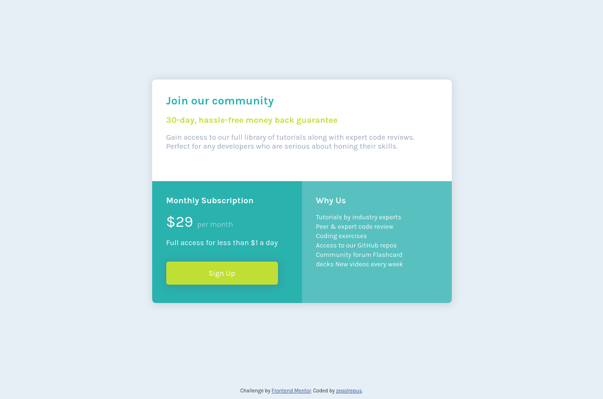

# Frontend Mentor - Single price grid component solution

This is a solution to the [Single price grid component challenge on Frontend Mentor](https://www.frontendmentor.io/challenges/single-price-grid-component-5ce41129d0ff452fec5abbbc). Frontend Mentor challenges help you improve your coding skills by building realistic projects. 

## Table of contents

- [Overview](#overview)
  - [The challenge](#the-challenge)
  - [Screenshot](#screenshot)
  - [Links](#links)
- [My process](#my-process)
  - [Built with](#built-with)
  - [What I learned](#what-i-learned)
  - [Useful resources](#useful-resources)
- [Author](#author)

## Overview

### The challenge

Users should be able to:

- View the optimal layout for the component depending on their device's screen size
- See a hover state on desktop for the Sign Up call-to-action

### Screenshot

### Links

- Solution URL: [Solution](https://github.com/zepolrepus/single-price-grid-component-master.git)
- Live Site URL: [Live Site](https://vercel.com/zepolrepus/single-price-grid-component-master)

## My process

### Built with

- Semantic HTML5 markup
- CSS custom properties
- CSS Grid
- Responsive

### What I learned

CSS Grid
media query

### Continued development

### Useful resources

- [A Complete Guide to CSS Grid](https://css-tricks.com/snippets/css/complete-guide-grid/)
- [Responsive Web Design - Media Queries](https://www.w3schools.com/css/css_rwd_mediaqueries.asp) 

## Author

- Frontend Mentor - [@yourusername](https://www.frontendmentor.io/profile/zepolrepus)
- Twitter - [@yourusername](https://www.twitter.com/yourusername)
